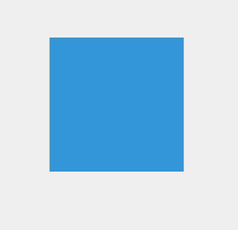

# MUDANDO CORES COM CLICKS

## Estudo de Algoritmos para Mudança de Cores com Clicks

Repositório criado com a finalidade de estudar formas de algoritmos para mudança de cores com clicks. (Esta ideia surgiu de uma dúvida em sala de aula com o querido professor Pietro, "Um carioca perdido em São Paulo!" kkk)

Na primeira versão do código, desenvolvemos um quadrado que, ao ser "clicado", tem a cor alterada. Utilizamos a seguinte lógica: Cada componente (vermelho, verde e azul) pode assumir 256 valores distintos de 0 a 255. Sendo assim:

`256 x 256 x 256 = 16.777.216 milhões de cores diferentes!`

Definida a lógica, vamos para o código.

### Adicionei a função `gerarCorAleatoria()`

A função `gerarCorAleatoria()` cria uma cor aleatória em formato RGB. Ela gera três números aleatórios (entre 0 e 255) para representar as cores **vermelho**, **verde** e **azul**. Em seguida, ela retorna a cor no formato `rgb(r, g, b)`.

- **Exemplo**: A função pode gerar a cor `rgb(120, 45, 200)`.

#### segue o resultado do primeiro exemplo:

  

## 
## Mostrando as cores embaixo do quadrado

Adicionei uma funcionalidade na qual é possível revelar o código da cor gerada após o click do mouse.

  

## Função `geraCorAleatoria()`

### Explicação da função `gerarCorAleatoria()`

A função `gerarCorAleatoria()` gera uma cor aleatória no formato RGB, que é comumente usado para representar cores em programação. O formato RGB é composto por três componentes de cor: **R** (vermelho), **G** (verde) e **B** (azul). Cada um desses componentes pode ter um valor de 0 a 255, onde 0 representa a ausência da cor e 255 representa a intensidade máxima dessa cor.

Aqui está o que a função faz, passo a passo:

1. **`const r = Math.floor(Math.random() * 256);`**
   - **`Math.random()`**: Gera um número aleatório entre 0 (inclusive) e 1 (exclusive).
   - **`Math.random() * 256`**: Multiplica esse número aleatório por 256, o que faz com que o valor fique entre 0 e 255 (o número 256 não é incluído).
   - **`Math.floor()`**: Arredonda esse número para baixo, garantindo que o valor de `r` seja um número inteiro entre 0 e 255. Esse valor representa a intensidade da cor **vermelha**.

2. **`const g = Math.floor(Math.random() * 256);`**
   - O mesmo processo é repetido para a cor **verde** (`g`), gerando um valor aleatório entre 0 e 255.

3. **`const b = Math.floor(Math.random() * 256);`**
   - O processo é repetido para a cor **azul** (`b`), gerando um valor aleatório entre 0 e 255.

4. **`return `RGB(${r}, ${g}, ${b})`;`**
   - A função retorna uma string no formato `"RGB(r, g, b)"`, onde `r`, `g` e `b` são os valores aleatórios gerados.
   - Por exemplo, se `r = 123`, `g = 45`, e `b = 200`, a função retornaria a string `"RGB(123, 45, 200)"`, que corresponde a uma cor específica.

### Resumo:
Essa função gera três valores aleatórios entre 0 e 255, representando as intensidades das cores vermelho, verde e azul, e retorna esses valores no formato `"RGB(r, g, b)"`, que é utilizado para especificar a cor.
